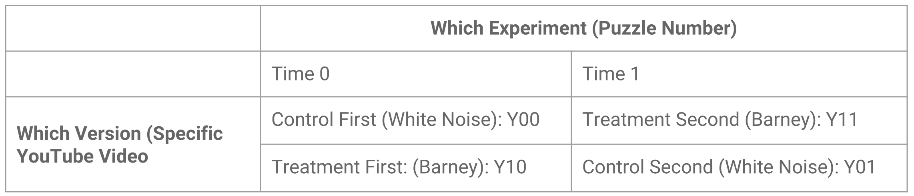

```{r setup, include=FALSE}
knitr::opts_chunk$set(echo = TRUE, tidy.opts=list(width.cutoff=60),tidy=TRUE)

# Installing all libraries
library(data.table)
library(dplyr)
library(foreign)
library(ggplot2)
library(gridExtra)
library(knitr)
library(lmtest)
library(magrittr)
library(multiwayvcov)
library(pander)
library(plm)
library(sandwich)
library(stargazer)
library(pwr)

# Cleaning the global environment
rm(list=ls())
```

# Abstract

The goal of our experiment is to assess the impact of music on cognitive function through the performance of activities that require logical reasoning. In our experiment, subjects were exposed to terrible music (the I Love You song by Barney and Friends) and white noise music during two Sodoku puzzle challenges back-to-back. Subjects were recruited through Mechnical Turk from different states / countries, with different levels of education, different levels expertise in logical games, and different ages ranging from 24 to 67 years old. The outcome measures we analyzed related to completion rate of the game as well as number of incomplete (white) spaces left after a given time limit. The results of our experiment did not find a significant casual relationship between different types of music and the ability to perform logic-related tasks.

# Experiment Overview

## Research Question   

What makes individuals productive? Does different noise affect this productivity? Some individuals seem to work better with complete silence and no interruptions, while others need music or some level of stimulation. Others may need to read in silence, but code with loud music. Thus, stimulation needed seems not only different from person to person, but differ within each task a person performs. As we thought about a research question, we wondered if there were any generalizations that can be applied to the role of stimulation, cognitive ability, and focus. What helps us focus? What makes it harder for us to focus? What makes humans more productive on tasks at hand? The research question, holistically, is: **do different sensory stimuli impact cognitive ability?**

## Why is This Interesting?   

We thought about different ways to increase or decrease cognitive ability with music. While, many times, music choice depends on personality traits and environment, the aim of this experiment will be to see if any generalizations exist with music's impact on cognitive function. The music used to decrease cognitive function is motivated by the U.S. government, which makes it quite interesting to us. In wars, the U.S. government and many other governments have used music on repeat as a form of torture, elaborated in two BBC articles: [one](https://www.bbc.com/news/world-latin-america-40090809) and [two](http://news.bbc.co.uk/2/hi/middle_east/3042907.stm). Several songs have been very effective at allowing governments to gain access to valuable information. While the U.S. government has these songs on repeat for extended periods of time, our experiment only lasts a matter of minutes. Therefore, song use would not rise to the level of torture or unethical treatment of subjects. One of the key songs used by the gonverment that also seemed appropriate for our experiment was the children's song, I Love You by Barney and Friends.

For the cognitive function piece of the experiment, or what we will actually expect subjects to _do_, we chose Sudoku. This game is a key logic game that is relatively familiar to the general public and knowledge of a specific subject or language is not critical. We also anticipate that Sudoku is the type of game where stimuli changes could affect cognitive function. 

## What Observational Work has Been Done?

Our review of other observation work indicates that no studies have directly proven a causal relationship between bad or distracting music and logical reasoning performance; however, a number of studies address adjacent topics and lead us to a mix of conclusions:

  + A [study by PsycNet](https://psycnet.apa.org/record/2008-16344-005) detailed working memory is susceptible to disruptions in speech and music, though familiar music had little effects on performance.
  + One [study by BioMed Central](https://behavioralandbrainfunctions.biomedcentral.com/articles/10.1186/1744-9081-6-3) did not find "substantial and consistent" influence of background music on verbal learning.
  + A [study published in the Journal of Consumer Research](https://www.jstor.org/stable/10.1086/665048?seq=1#metadata_info_tab_contents) indicated that a high level of noise hurts creativity.
  + One review of existing [studies by a team at McGill University](https://www.mcgill.ca/newsroom/channels/news/major-health-benefits-music-uncovered-225589) identified that listening to music could reduce a patient's stress by reducing the production of the stress hormone cortisol in the body.
  + Another [study published in Research Gate](https://www.researchgate.net/publication/248968673_The_Effects_of_Background_Music_on_Primary_School_Pupils'_Task_Performance) indicated that unpleasant music disrupted performance on a memory task.
  + A small [study by PsycNet](https://psycnet.apa.org/record/1993-29330-001) indicated that subjects with background music achieved greater productivity when background music was in "major mode".
  + Another small [study published in Wiley](https://onlinelibrary.wiley.com/doi/abs/10.1111/j.1365-2702.2004.01103.x?deniedAccessCustomisedMessage=&userIsAuthenticated=false) showed that participants psychological and physiological relaxation was greater for individuals who rested and listened to music versus those who just rested.
  + Another [study by the National Center for Biotechnology Information](https://www.ncbi.nlm.nih.gov/pubmed/16950722) identified that thinking-intensive tasks such as proofreading was impacted by environments, which included speech.
  + A [study published in The Journal of the Acoustical Society of America](https://asa.scitation.org/doi/abs/10.1121/1.4920363) indicated that ambient natural sounds could improve employee productivity and moods.
  + Another small [study published in Sage Journals](https://journals.sagepub.com/doi/abs/10.1177/0305735605050650) shows that individuals who did not listen to music (versus listening to music) had greater time-on-task but lower quality-of-work.
  + One of the first [studies published in Science Direct](https://www.sciencedirect.com/science/article/pii/0003687072901019) on this topic showed that music is "effective at increasing efficiency in [repetitive work]."
  + A further [study published in Research Gate](https://www.researchgate.net/publication/230746039_Exposure_to_music_and_cognitive_performance_Tests_of_children_and_adults) demonstrated that exposure to different types of music can enhance performance on a variety of cognitive tests.
  + A [study published in Wiley](https://onlinelibrary.wiley.com/doi/abs/10.1348/026151002166433) probing the "Mozart Effect" demonstrated that there was no impact on children who listened to a specific Mozart sonata with respect to spatial ability.
  + Another [study published in Wiley](https://onlinelibrary.wiley.com/doi/abs/10.1002/acp.16923) generally confirmed its hypothesis that performance of introverts on complex cognitive tasks was worse in the presence of music.

These studies and reviews demonstrate that there has been little research conducted regarding "bad" or "annoying" music and its impact on logical reasoning performance; rather, most of the literature focuses on "good" music or background music to aid reasoning, cognitive and physical tasks.

# Research Design

## Environment
As we anticipated including over 130 subjects (see power calculations below), we conducted some brief math to understand how best to move forwards with the research design. We began with estimating that treatment (discussed below), will take a minimum of approximately 10 minutes, plus 3 minutes of instruction and setup and 2 minutes debrief and payment. Thus, 15 minutes times 130 subjects yields over 32 hours, exclusive of the time it takes to acquire the subjects, coordinate them, test them, and analyze their results. As a result of these back-of-the-envelope calculations on time, the team decided to prioritize efficiency and acquire subjects through Amazon's Mechanical Turk service and conduct the experiment online.

The benefits for using Mechanical Turk included speed, consistency, secure payment, and a diversity of subjects. With respect to speed, the primary benefit of leveraging the Mechanical Turk platform was that, similar to a MapReduce process, we could map a job (experiment) across multiple subjects simultaneously, then the results are reduced by technology and verified by the human-in-the-loop.  

Instead of over 32 hours of continuous human supervision, we were able to reduce the time to a handful of hours of setup, execution, and verification of the data. Mechanical Turk also provided a more consistent experience as it was agnostic to the experimenter (as we would suspect that Danielle, Osmar, or Dan, even if following a script, would vary their instructions or environment slightly, which would require another blocked variable and analysis). Further, as the data was automatically collected, errors and omissions were reduced yielding more consistent data.  

Additionally, remuneration for subjects was handled automatically via the Mechanical Turk system. This obviated the need to hold money in cash, which presents additional risk for the experimenters. Further, there is a more robust paper-trail in case of auditing in relation to the experiment.

Finally, Mechanical Turk presented the opportunity to recruit subjects from a diversity of backgrounds. Whereas we would previously have been limited to engaging with local subjects in the Berkeley, Miami, and New York areas, Mechanical Turk facilitated the reach into new geographies as the platform is location agnostic. If we were all recruiting among our friend or work groups in specific locations, the changes of spillover would be higher. While Mechnical Turk subjects may talk to each other about HITs, we still believed the opportunity to mitigate spillover would be better on Mechnical Turk

The primary drawback for using Mechanical Turk regarded compliance monitoring. As we were unable to visually confirm complete compliance of our experiment protocols, we compromised and instituted several compliance checks, described below. Again, our research team felt that this was an acceptable tradeoff and we would work to ensure compliance with a few procedures also described below.

## Experimental Design Overview

We developed a three-part experiment leveraging two platforms to acquire, treat, and analyse subjects.

First, we found subjects on Mechanical Turk, recruiting all those that were Mechnical Turk Masters and had clearly done many Human Intelligence Tasks (HITs). After participants opened the Mechnical Turk survey, they were then directed to open a Qualtrics survey link. We set up the formatting of the survey so that the Berkeley Logo displayed as a header on every Qualtrics page to identify the survey as an academic research initiative.  

The first component of the Qualtrics survey asked for demographic and behavioral information that we could later control for in our analysis described below. We mandated that all respondents complete all fields. We collected demographic information that included age, current city, state, and country, native language, a 6-option scale of highest education encompassing some high school or less to doctoral degree, and behavioral information that asked about respondents self-identification of being a "morning" or "night" person, expertise of logic games on a 1 to 5 scale, how many minutes does the respondent play logic games in an average week, and knowledge of sudoku on a 1 to 5 scale. All these questions were displayed on one page pictured below.

The next page alerted the subject that there would be two Sudoku games in the experiment and invited the subject to read a description about the rules of the game, along with viewing an example Sudoku game board.  

```{r, echo=FALSE,out.width="40%", fig.cap="Survey Questions and Sudoku Rules",fig.show='hold',fig.align='center', fig.pos='H'}
knitr::include_graphics(c('./survey_images/Survey_P1.png','./survey_images/Survey_P2.png'))
```

The subjects were then presented the first test page and then the second subsequent test based upon randomization described below. On each test page, the subjects were presented with a title and serial number of the test, for example, Test # A718C: Lucky Railroad or Test # A122G: Blue Waterfall. These were dummy names and test serial numbers used as a secondary measure for indicating that there were two different tests running sequentially, to reduce the potential frustration of users feeling that they just filled out this test before.

The page included a [link](https://sites.google.com/view/sudokuinstructions/home) to an external webpage we created with the same Sudoku instructions should a participant need to refer back to them while playing the game.

The Qualtrics survey then broke down the current experiment into six steps. The first step directed the subject to open a Youtube video with the control or treatment conditions. The second step instructed the user to play the Youtube video at 50% computer volume and alerted the subject of a confirmation condition where a number will be repeated every 30-60 seconds in the treatment. Step three prompts the subject to solve the randomly generated sudoku puzzle for five minutes, or less if completed sooner, and provides a [link](https://www.sudokukingdom.com/very-easy-sudoku.php) to the Sudoku game and instructions to continue to listen to the treatment or control music. Step four instructs the user to stop the Youtube video, take a screenshot of the Sudoku board at the completion of the time or their completion of the game along with the timer that is displayed on the board and upload it as a PDF, JPG, or PNG.  Then, the fifth step, as described above, asks the user to input the compliance check number. Finally, the user is prompted to close all browsers except the current survey and proceed to the next page. Again, this protocol repeats twice.

After completing the two instances of the experiment, on the last page in the Qualtrics survey, the platform displays the user's unique Mechanical Turk code, which is the unique identifier that Qualtrics uses as the user ID. The survey prompts the subject to enter the ID into both the box below the question in Qualtrics as well as on Mechanical Turk to facilitate cross-validation of the user. Finally, there is a text box enabling subjects to input their email if they would like to be updated about the results of the survey.

```{r, echo=FALSE,out.width="30%", fig.cap="Survey Experiment and Confirmation",fig.show='hold',fig.align='center', fig.pos='H'}
knitr::include_graphics(c('./survey_images/Survey_P3.png','./survey_images/Survey_P4.png','./survey_images/Survey_P5.png'))
```

## Renumeration

All subjects were incentivized to participate in the experiment through the use of a monetary reward. For our pilot test, we set the price for successful completion of the protocol at $2.50. The price was set higher than other comparable tests because we had to set up a new account with no history and thereby leverage an increased price to mitigate the increased risk of a new requester profile. This pilot HIT attracted many respondents and provided quick results. 

As we discovered we would need to increase the sampled subjects, we reduced the price to $2.15 assuming that the project would be completed perhaps more slowly, but within acceptable time parameters. The value we set was based upon the success we had in our pilot, the constraint of needing more sampled subjects, and mitigation of our new account. We also set the maximum completion of the survey to 35 minutes so that users would respond and complete the experiment in a reasonable time. We observed that we priced appropriately and ethically by comparison to other surveys because we quickly received enough respondents within a handful of hours. All remuneration was issued by Mechanical Turk and deducted from an account set up by the researchers.

## Pilot Experiments

The team conducted several pilot experiments that informed our direction of our final experiment.

Our first battery of experiments involved asking users to attempt to complete the Sudoku puzzles without any control or treatment noise. We were testing to see how feasible it was to expect the average user to complete the entire puzzle without any type of time limit. We observed from this pilot that it was unrealistic to expect the majority of individuals to complete the puzzle without giving up. Most individuals who gave up cited frustration or too much time spent.

One interesting observation was that for subjects who were familiar with Sudoku, but did not regularly play the puzzle game, there was a marked learning curve where the first game took a relatively longer time to complete than subsequent games. As a result of this outcome, we restructured our experiment to test two games of Sudoku, where one game would facilitate the learning process and the second Sudoku game would allow for the user to demonstrate their skill.  

As a function of our findings of a learning curve, the research team decided to move forward with a test that randomly applied a treatment (of the test music) and a control (of white noise) to measure a difference-in-differences effect of ability in each game.

Our final pilot experiment was executed on Mechanical Turk with 10 subjects. The pilot experiment was generally successful and helped us tweak instructions and protocol for the subjects. Following this pilot, we launched our full experiment.

## Compliance Checks

Compliance for the experiment consisted of three checks:

The first check was the capture of the time in the screenshot that the subjects would take and upload to the website. The protocol instructed subjects to take five minutes to solve the puzzle. The research team was able to validate compliance by individually viewing and recording each screenshot of the Sudoku board that included a stopwatch that indicated how long the subject had cumulatively spent on the puzzle. The stopwatch only begins when a user enters in a number, which protects against individuals loading the page and then waiting to begin the puzzle moments later; however, it does not guard against individuals solving the puzzle first and then inputting in the numbers. From our pilot survey we observed that this concern was not material. This compliance check served to ensure that users spent the correct amount of time completing the puzzle and that we would be able to make an apples-to-apples comparison. Beyond editing the photo or solving the puzzle before inputting the numbers, we did not imagine a way of circumventing this concern.

The second compliance check occured after the user finished the puzzle or five minutes had elapsed, and then proceeded to ask the user to input a number that was repeated in the treatment and control audio. For control, the number was 83 and for treatment the number was 67 (although we accepted 57 as well). This compliance check measured whether the user had listened to the audio recordings while playing the game. One means of circumventing this compliance check was to listen to the recording until the subject heard the number and then mute the audio. While we instructed the subjects to set their computer volume at 50%, another means of non-compliance would be to lower the volume level after they hear the two-digit number.

The final compliance check was on the last page of the experiment and prompted the user to enter in a code displayed above the text field box. This was a code that was dynamically displayed based upon the randomly generated user ID associated with their Qualtrics session. This compliance check served as extra assurance that users completed both the treatment and control. We could not imagine a means to circumvent this compliance check.  

## Randomization

[ROXO Grammar](http://wikiofscience.wikidot.com/methods:experiment):

Experimental Group 1: E O R -- X O
Experimental Group 2: E O R X -- O

  + E = randomization allocation to **e**quivalent groups
  + O = **o**bservational information (demographics, initial questions, response back into MTurk)
  + R = **r**andomized order of treatment and control
  + X = treatment
  + -- = control

One level of randomization was used in this experiment. We leveraged Qualtrics's built in randomization functionality to randomize the order in which respondents saw treatment and control. This procedure allowed us to measure an effect whereby the music could impact both the learning (treatment upon first test) as well as the impact of music on subsequent plays of the game. Part of the rationale for this was due to the fact that we observed through pilot studies that individuals frequently performed significantly better with respect to percentage completion of the puzzle in addition to the time of completion after their first game.

A further level of randomization that was not measured or controlled in this experiment was the fact that respondents were sent to a website that randomly generated Sudoku puzzles. The research team did not investigate the random chance that the subject could receive the same puzzle twice in a row, but made the assumption that this was very improbable. The website that generated the puzzles always made sure that within levels of expertise, the same amount of numbers were filled in at the beginning of the game.

## Experimental Materials

Subjects were exposed to a randomized treatment and control protocol, described above. All valid, non-attriting, compliant subjects experienced the treatment and control protocols.

The [control protocol](https://www.youtube.com/watch?v=ONfoo_VlAfY) involved listening to a Youtube video where the visual content was not important; rather, as described to the subject, the audio was only what the subject needed to focus on while completing the exercise. The control audio consisted of an approximately 30-minute track of one minute of randomly generated white noise and then a repeating two-digit number, 67.  

The [treatment protocol](https://www.youtube.com/watch?v=lVcw4S1Oj8A) consisted of a Youtube video similar to the control video where the visual content was not important but consisted of a [song](https://www.youtube.com/watch?v=ix9wpslKwBE) associated with the children's television show Barney & Friends. This song was selected due to its millennial pop-culture association with being a hypnotizingly "bad" song. This song along with another two-digit number, 83, composed the approximately 30 minute-long treatment track.

The logical reasoning component of the experiment that measured the degree of progress was the Sudoku website SudokuKingdom. The experiment leveraged [SudokuKingdom's](https://www.sudokukingdom.com/very-easy-sudoku.php) randomly generated Sudoku game boards and the researchers selected the "very easy" mode, in which 45 of the 81 squares are filled in. The puzzle displayed that these boards were categorized as "very easy" along with the functionality to undo a move, restart, print, and monitor how much time has elapsed. Each group of nine squares subsequently had five numbers filled in. We selected SudokuKingdom as our platform because of its intuitive means of filling in the number in the Sudoku boards, its ability to automatically load a "very easy" level board, and its clearly visible timer.

The researching team decided to use this platform for its simplicity though realized that there were drawbacks. The website also had a fair amount of superfluous content, such as banner advertisements on both the left and right side of the Sudoku board, a player rankings board below the sudoku board, and a picture that filled in as the user completed the board to the left of the board. The website also allowed subjects to reload the page and get a new puzzle if a subject wanted to switch for some reason.

Further, in hindsight, it would have behooved the experiment if the research team selected two pre-set boards so that all users could complete the same puzzles. While we are confident that the "very easy" selection is fairly consistent across all randomly designed boards, being able to more easily compare apples-to-apples occured to the research team after the fact. This being the case, however; there might not have been a perfect solution because SudokuKingdom does not have a means of serializing the individual games and we would have needed to find an alternate platform to conduct the experiment as well as ensure no spillover among subjects. 

## Experiment Potential Outcomes  

Our experiment had two groups of observed subjects. The structure of our outcomes is as follows for our pair-wise study: 

Group A 

  + y00: y0, Control (white noise) in Time 0
  + y11: y1, Treatment (Barney I Love You song) in Time 1  
  
Group B  

  + y10: y1, Treatment (Barney I Love You song) in Time 0
  + y01: y0, Control (white noise) in Time 1   

The figure below describes the experimental design further: 

```{r, echo=FALSE,out.width="70%", fig.cap="Experimental Design",fig.show='hold',fig.align='center', fig.pos='H'}

```

## Measurement of Variables 

We chose three key ways to measure the degrees of success in this experiment. Two of these outcomes were within subject experiments and one was between subject experiments:

  + Within-Subject Outcomes:    
      - *Completion* - 1 if the player finished the game within five minutes; 0 otherwise. This outcome applied to all respondents who finished the game in one puzzle and did not finish the game in another     
      
      - *Number of Boxes Left Empty* - The data in this column represents the number of white spaces or boxes that are not filled left on the Sudoku board in an individual game. If a subject completed the entire game, no white spaces would be left and this value would be zero. As described above, we assumed that all cells filled within the Sudoku board were correct. These values were counted manually by the research team and are subject to some counting and recording errors. The possibility does exist for incorrect numbers to be entered, although if the number already existed in the box, row or column, the puzzle would not let it be entered. The only way to ensure true accuracy of the puzzles would be to solve each one, which would be a trenmendous undertaking. The research team decided to forgo this exercide and assume that the squares were correct. Even if the squares were not correct, the incorrectness would be randomly assigned.     
      
          
  + Between Subject Outcomes:    
      - *Completion of the First Game* - 1 if the player finished the first game, 0 otherwise. In this situation, we are comparing outcomes between subjects. We will be blocking for the treatment vs. control represented in the first game (i.e. the Barney song vs. white noise). We will also be controlling for various covariates such as level of education, knowledge of Sudoku, knowledge of logic games in general, time spent playing games, morning vs. night person, and all other variables that we asked about in the beginning of the Qualtrics survey.       
      
## Pre-Experiment Power Calculation

We estimated the power of our experiment for two out of three outcomes using Cohen's D distance. More specifically, we estimated the power outcomes on both of our within-subject measures, namely number of white spaces left on the board at five minutes of completion, and completion or not of the game at five minutes of doing the puzzle. First we decided that our practical significance would be to detect a difference of at least one white space and assumed a standard deviation twice the detection value giving us a Cohen's distance of 0.5. Similarly, for the Completion outcome, the minimum completion percentage of practical significance that we wanted to detect was 10% or 0.01, and assumed a standard deviation of 0.02, which gave us a Cohen's distance of 0.5. 

```{r, echo=FALSE}
# Difference in means to detect significance
detect = 1
Cohen.d = 0.5
pwr.t.test(
  n=100,
  d= Cohen.d,
  sig.level = 0.05,
  power = NULL,
  type = 'paired',
  alternative = 'two.sided'
)
```

+---------------+------------+-------------+-------------+----------+    
|   Outcome     |      N     |  Cohen's D  |   Test      |  Power   |
|               |            |effect size  |   Type      |          |
+===============+============+=============+=============+==========+  
|  White spaces |    100     |  0.50       |   Paired    |   0.99   |  
+---------------+------------+-------------+-------------+----------+  
|  Completion   |    100     |  0.50       |   Paired    |   0.99   |
+---------------+------------+-------------+-------------+----------+  


# Result Overview

We exported the data from Qualtrics to Google Sheets to do our manual quality assurance, and then to a CSV to enable analysis and processing in RStudio. A preview of our data is below.

```{r, echo=FALSE}
#Loading the data into memory
data <- fread('resultsc.csv', header = TRUE)

# Columns to be kept for analysis
d <- data[,-c(2,4,5,7,8,10,11,13,17,18,19,20,24,25)]

# Previewing the data
kable(head(d %>% select(1:7)))
kable(head(d %>% select(8:15)))
```
 
## Results Description

### Key Outcome-Related Variables:  
  + *Treat* - This column represents the treatment randomization. A `1` within this column represents that a subject was exposed to treatment (i.e. the Barney song) and a `0` represents that a subject heard the white noise control.    
  
  + *Puzzle_num* - This column represents the puzzle number of the respondent, keeping in mind that each respondent completed two puzzles. A `0` means that a respondent is playing their first game and `1` means that a respondent is in their second game. As we are doing a pair-wise experiment, it's very important to  ensure that we are controlling for whether someone is playing their first or second game. Due to the learning curve described above, respondents could improve in their Sudoku playing on their second game, which contributes to our decision to measure difference in differences in some of our outcomes.    
  
  + *ID* - As described above, we conducted a pair-wise study, so each subject ID is listed in here twice to represent the two games that each survey respondent played.     

### Pre-test Measurements:  
We converted our pre-test demographic and behavioral metrics into ordinal ranks and one-hot-encoded education atainment.  

  + *Expertise_logic_games* - Self ranking expertise in logic games from 1(low) to 5 (high)
  + *Time_playing_logic_games* - How many minutes a respondent plays logic games in an average week
  + *Expertise_logic_sodoku* - Self ranking expertise in playing Sodoku from 1(low) to 5 (high)
  + *Morning* - If someone is a morning person `1`, otherwise `0`
  + *Master* -  `1` if education level is "Master Degree"; `0` otherwise
  + *Bachelor* - `1` if education level is "Bachelor Degree"; `0` otherwise
  + *Associate* - `1` if education level is "Associate"; `0` otherwise
  + *High_School* - `1` if education level is "High School"; `0` otherwise

## Cleaning and Exploratory Data Analysis  

Our exploratory data analysis begins with subsetting the data and evaluating attrition. We will subsequently conduct an exploratory data analysis on our control and treatment variables to see examine the distribution of our data.

### Attrition

First, we will begin with looking at our attrition and removing it from our exploratory data analysis as we know that the results are not accurate

&nbsp;

**1) Subjects with at least one or more missing outcomes:**

```{r, echo=FALSE}
missing_outcome <- d[rowSums(is.na(d))>1,.(ID,White_spaces,Completion,
                                           ResponseId),][order(ID)]
kable(missing_outcome)
```
There are `r {length(unique(missing_outcome$ID))}` subjects with at least one missing outcome.  

&nbsp;

**2) Subjects where the second screenshot uploaded is a copy of the first game:**   

These IDs have the same video number and exactly the same time to finish the game.  

```{r, echo=FALSE}
# Checking exact same duration and compliance number  
duplicated_data <- d[,
        .(diff_duration=data$Duration[d$Puzzle_Num==1]-data$Duration[d$Puzzle_Num==0],
          ID,
          Duration,
          white1 = White_spaces[Puzzle_Num==1],
          white0 = White_spaces[Puzzle_Num==0],
          video0 =Video_number[d$Puzzle_Num==0], 
          video1 =Video_number[d$Puzzle_Num==1])
          ][diff_duration==0 & (video1==video0),.(ID,video1,video0,Duration,diff_duration)][1:8]
kable(duplicated_data)
```

There are `r {length(unique(duplicated_data$ID))}` additional subjects with one missing outcome. In total we have an attrition of `r {length(unique(duplicated_data$ID)) + length(unique(missing_outcome$ID))}` subjects or `r {signif(12/139*100,2)}`% attrition, `r {signif(100-12/139*100,2) }`% of the outcomes are observables or 127 subject outcomes are observables. Please see the figure below to understand the dropoffs and where they occured in the experiment flow.  

```{r, echo=FALSE,out.width="40%", fig.cap="Experimental Design Attrition Understanding",fig.show='hold',fig.align='center', fig.pos='H'}
knitr::include_graphics(c('./Experimental_design.png'))
```

From a compliance perspective, we decided to keep all of the observable outcomes within our experiment. This eliminated any element of "picking and choosing" from our side, and prohibited us from succumbing to any fishing expeditions. Even though we told subjects to limit their time to five minutes we decided to still keep all respondents in our analysis including those who took signficantly longer than the deliniated five minutes. Our rationale is that the main focus of our experiment and our outcome measures relates to within-subject outcomes, which should control for timing variability. For our between-subject outcome, we wanted to make sure that we were comparing similar populations, and still chose not to eliminate any subjects. Our goal was to keep as many subjects in our analysis as possible to try our best to make casual and generalizable claims about our findings.

### Differential Attrition

Before we dive into the rest of our exploratory analysis and result, we wanted to look to see if we could identify patterns regarding attrition and understand its full impact. We wanted to see if we could understand _why_ someone may have attrited from our experiment and if this would significantly impact our results and outcome analysis.

In order to level set first with regards to who actually attrited, we have created a table to put the amount of attrition vs. observed outcomes into context. First, we wanted to generate the necessary data on observed vs. unobserved participants:
```{r}
# Generating the "Observed" variables
d[!(ID %in% duplicated_data$ID) & !(ID %in% missing_outcome$ID),observed:=1]
d[!(!(ID %in% duplicated_data$ID) & !(ID %in% missing_outcome$ID)),observed:=0]

# Limiting dataframe to unobserved outcomes
d_unobserved <- d[observed==0]

# Limiting dataframe to observed outcomes for later on
d2 <- d[observed==1]
```

Next, we have a table showing all that is occuring within out dataset observed and unobserved dataset.
```{r, echo=FALSE}
attrition.subjects <- t(d[Puzzle_Num==0,.N,by=.(Treat,observed)])[3,4:3]
observed.subjects <- t(d[Puzzle_Num==0,.N,by=.(Treat,observed)])[3,1:2]
attrition_mtx <- rbind(attrition.subjects,observed.subjects)
aux <- rbind(attrition_mtx, margin.table(attrition_mtx,2))
totals <- cbind(aux,margin.table(aux,1))
colnames(totals) <- c("Treat", "Control", "Totals")
rownames(totals) <- c("Attrition", "Observed", "Initial Subjects")
kable(totals)
```

Surprisingly, attrition is a bit more commmon within the control group. The awful Barney music in the treatment group did not throw off many of our subjects. This being said, the level of attrition within treatment and control does not appear to be incredibly different. We will conduct a two proportion test below to determine if the level of difference is significant and something that we should correct for throughout our regression analysis.

Two proportion test confidence interval:
```{r}
prop.test(c(d_unobserved[Puzzle_Num==0 & Treat == 1,.N],
            d_unobserved[Puzzle_Num==0 & Treat == 0,.N]),
            c(d[Puzzle_Num==0 & Treat == 1,.N], 
            d[Puzzle_Num==0 & Treat == 0,.N]))$conf.int
```

Two proportion test p-value:
```{r, echo=FALSE}
prop.test(c(d_unobserved[Puzzle_Num==0 & Treat == 1,.N],
            d_unobserved[Puzzle_Num==0 & Treat == 0,.N]),
            c(d[Puzzle_Num==0 & Treat == 1,.N], 
            d[Puzzle_Num==0 & Treat == 0,.N]))$p.value
```

From the analysis above, we can see that there is a `r {round(prop.test(c(d_unobserved[Puzzle_Num==0 & Treat == 1,.N], d_unobserved[Puzzle_Num==0 & Treat == 0,.N]), c(d[Puzzle_Num==0 & Treat == 1,.N], d[Puzzle_Num==0 & Treat == 0,.N]))$p.value * 100,digits=2)}`% chance that the attrition within treatment and control happened by random chance. Therefore, we will not look to correct anything within our subsequent regressions and results analysis.

For another check to see if / how attrition could effect our results, we used a logistic regression to check the impact of differential attrition. More specifically, we used several of our main pre-treatment covariates to predict the probabilities of having an outcome in the first game or not.

```{r}
probobs <- d[Puzzle_Num==0 ,glm(observed ~ 
                      (Treat*Age) + 
                      (Treat*Expertise_logic_games) +
                      (Treat*Expertise_logic_sodoku),
                    family=binomial(link = "logit"))$fitted]
```

Then, we looked at the summary statistics of the probabilities for treatment and control to see the distribution or predicted probabilities of attrition among these two groups.

Control Summary Statistics:
```{r, echo=FALSE}
d[Puzzle_Num==0,summary(probobs[Treat==0])]
```

Treatment Summary Statistics:
```{r, echo=FALSE}
d[Puzzle_Num==0,summary(probobs[Treat==1])]
```

From the summary statistics above, we can see that the rate of attriting is a bit more common in the control group, which goes against our intuition. However, as the average rates of attriting are not that high in either situation, and our two proportion test was insignificant, we will stay on the course of not correcting in our regressions.

Now that we have determined that the level of attrition will not signifcantly affect our analysis, we will conduct further exploratory analysis on our attriters. We will explore what a sample of our pre-treatment variables look like for those that winded up attriting out of the treatment and control groups.

```{r, echo=FALSE}
# Only looking at initial puzzle
unobserved_table <- d_unobserved[Puzzle_Num == 0, .(Treat_Num = .N, 
                                Mean_Age = mean(Age), 
                                Mean_Morning = mean(Morning),
                                Mean_Sudoku_skills=mean(Expertise_logic_sodoku),
                                Mean_Logic_Game_Skills=mean(Expertise_logic_games)),
                                by=list(Treat)]

kable(unobserved_table)
```

These variables do not point us in any real general direction. The treatment group that stopped has a slight skew towards morning people compared to the control group, but overall this skew is quite small and many of the covariates are fairly equal.


### General Exploration

Now, we can evaluate some of our key outcome variables with all data that we will use within our regression analysis.

```{r, echo=FALSE}
# Number of white spaces
summary(d2$White_spaces)
```
For the white spaces feature, we observe that the median is smaller than the mean, meaning that the data is skewed to the right. The summary statistics from this stage show that across all of our presently cleaned data, there is on average approximately `r {round(summary(d2$White_spaces)[4])}` white spaces left on each board when the time is up. We see a maximum of `r {round(summary(d2$White_spaces)[6])}` white spaces spaces left (out of a total of 36 white spaces at the beginning of the game).  The median number of white spaces when the respondent stops the time around five minutes is `r {round(summary(d2$White_spaces)[3])}`.  

In the first game, we see `r {round(d[Puzzle_Num==0,summary(White_spaces)][4], digits=2)}` on average, while in the second game, the number of white spaces improves a bit to `r {round(d[Puzzle_Num==1,summary(White_spaces)][4], digits=2)}` on average. We will do more casual investigation, but overall we do see a slight trend in the direction that we would expect in that participants improve during their second game.

```{r, echo=FALSE}
# Games completed
summary(d2$Completion)
```
With respect to the completion feature, we observe that in approximately `r {round(summary(d2$Completion)[4] * 100)}`% of the games in this cleaned data set, the boards were entirely completed. The completion rate of the first game (that is, no white spaces left) in our cleaned data set is approximately `r {round(d2[Puzzle_Num==0,summary(Completion)][4] * 100,digits=2)}`%. Showing a similar trend that we are seeing with regards to slight improvement in the second game, we see that in our cleaned data set, the completion of the second game is approximately `r {round(d2[Puzzle_Num==1,summary(Completion)][4] * 100,digits=2)}`%.

### Self-reported Pre-test Behavioral Data  

```{r fig.width=7, fig.height=5, echo=FALSE}
par(mfrow=c(2,3))

hist(d2$Expertise_logic_games,breaks = seq(0.5,5.5, by= 1), 
     xlab = "Expertise level in logic games 1(low) 5(high)",
     main="Logic Games Expertise",
     cex.lab = 0.75, 
     cex.axis = 0.9, 
     cex.main = 0.75,
     col="royalblue")

hist(d2$Time_playing_logic_games,
     xlab = "Number of logic games played per week",
     main="Playing Frequency",
     cex.lab = 0.75, 
     cex.axis = 0.75, 
     cex.main = 0.9,
     col="royalblue")

hist(d2$Expertise_logic_sodoku,breaks = seq(0.5,5.5, by= 1),
     xlab = "Expertise playing Sodoku 1(low) 5(high)",
     main="Sudoku Expertise",
     cex.lab = 0.75, 
     cex.axis = 0.75, 
     cex.main = 0.9,
     col="royalblue")

hist(d$Age,breaks = 10,
     xlab = "Age",
     main="Subjects Age Distribution",
     cex.lab = 0.75, 
     cex.axis = 0.75, 
     cex.main = 0.9,
     col="royalblue")

d2$Degree <- factor(d2$Degree)
barplot(table(d2$Degree), 
        main= "Distribution of Degrees",
        cex.lab = 0.75, 
        cex.axis = 0.75, 
        cex.names = 0.4,
        cex.main = 0.9,
        xlab = "Education",
        ylab = "Frequency",
        col = c("skyblue", "slateblue", "steelblue", "royalblue2"))
```

Including all of the subjects, with respect to expertise in logic games, we see a gaussian-like distribution with a signficant majority of subjects reporting average expertise in logic games. However, we observe a heavily right-skewed distribution of individuals who self-reported the time they spend in an average week playing logic games.

One individual reported spending `r {d2[,max(Time_playing_logic_games),]}` minutes, or `r {d2[,max(Time_playing_logic_games),] / 60}` hours per week playing logic games. While this is conceptually reasonable, it did represent the upper-bounds of our respondents. From our distribution, we observe that 75% of our respondents spent an hour or less per week playing logic games.
 
With respect to the self-reported metric on expertise playing Sudoku, the majority of individuals reported a level 1, 2, or 3 representing novice to medium farmiliarity of the game. Only a few individuals self-identified as Sudoku masters.  

The self-reported age metric is centered generally around 35 years of age with fewer and fewer respondants citing older ages. This makes intuitive sense as most individuals who are computer savvy and on Mechnical Turk in the first place would likely skew younger.

### Within-Subject Outcome Review (Tretment vs. Control)

We see the difference within subjects tend to have a distribution closer to the normal distribution. Negative difference in the graph to the left means that the control game had more white spaces left on the board than the treatment. The graph of difference of white spaces is skewed to the right. Negative difference in the graph to the right means that the control game had a completion and the treatment game did not. The graph of difference of completion is slightly skewed to the left.

```{r fig.width=6, fig.height=6, echo=FALSE}
par(mfrow=c(2,2))

hist(d2[,White_spaces[Treat==1]-White_spaces[Treat==0]],
     xlab= "White spaces difference",
     main= "Difference in White spaces",
     cex.lab = 0.75, 
     cex.axis = 0.75, 
     cex.main = 0.75,
     col="royalblue")

hist(d2[,Completion[Treat==1]-Completion[Treat==0]],
     xlab= "Number of games completed difference",
     main="Difference in # of Games Completed",
     cex.lab = 0.75, 
     cex.axis = 0.75, 
     cex.main = 0.75,
     col="royalblue")
```

## Result Review

### Covariate Balance Checks

First, we need to change the degree variable from a categorial variable to an interval variable so that we can perform proper covariance balance checks and use this variable within our regressions later on. Having all of the degree variables as separate dummy variables was helpful for us to see the data earlier on.
```{r}
d2$Degree_Interval = ifelse (d2$Degree == "High School", 0.25,
                          ifelse(d2$Degree == "Associate", 0.5,
                                 ifelse(d2$Degree == "Bachelor", 0.75, 1)))
```

```{r echo=FALSE}
# Creating a continuous variable for the Degree variable

# Creating the table for Covariate balance checks
table1 <- d2[,.(mean_Age=mean(Age),
               mean_Sudoku_skills=mean(Expertise_logic_sodoku),
               mean_time_playing=mean(Time_playing_logic_games), 
               mean_logic_game_skills=mean(Expertise_logic_games),
               mean_morning=mean(Morning),
               mean_Degree=mean(Degree_Interval),
               .N),by=.(Treat,Puzzle_Num)]

# Covariate balance checks accross treatment / control groups, puzzle num 1 / puzzle num 2
cov_analysis <- t(table1)
colnames(cov_analysis) <- c("Y10","Y00","Y01","Y11")
cov_analysis
```

The table above shows very similar means among those who started treatment first and those who started control first. The first two columns are the same as the second two columns because all participants had to complete two games within our experiment. We would expect the covariates to be fairly similar as these results were finalized pre-treatment and should be completely irrespective of the eventual treatment order.

Just to be extra sure that we had covariate balance, we have looked at all of the p-values of t-tests between the covariates in each treatment case below.

```{r}
# Only code used for the initial t-test is shown
paste("Age covariate p-value:", round(t.test(d2[Treat == 1 & Puzzle_Num == 0, Age], 
                                             d2[Treat == 0 & Puzzle_Num == 0,
                                                Age])$p.value,digits=2))
```

```{r, echo=FALSE}
paste("Sudoku Skills covariate p-value:", round(t.test(d2[Treat == 1 & Puzzle_Num == 0, Expertise_logic_sodoku], d2[Treat == 0 & Puzzle_Num == 0, Expertise_logic_sodoku])$p.value,digits=2))

paste("Time Playing Logic Games covariate p-value:", round(t.test(d2[Treat == 1 & Puzzle_Num == 0, Time_playing_logic_games], d2[Treat == 0 & Puzzle_Num == 0, Time_playing_logic_games])$p.value,digits=2))

paste("Logic Game Skills covariate p-value:", round(t.test(d2[Treat == 1 & Puzzle_Num == 0, Expertise_logic_games], d2[Treat == 0 & Puzzle_Num == 0, Expertise_logic_games])$p.value,digits=2))

paste("Degree covariate p-value:", round(t.test(d2[Treat == 1 & Puzzle_Num == 0, Degree_Interval], d2[Treat == 0 & Puzzle_Num == 0, Degree_Interval])$p.value,digits=2))
```

From the p-values above, we do not see any cause for concern that these covariates are correlated with our treatment. The covariate of time playing logic games appears to be significant. However, we discussed above how the maximum value here is a large outlier. Therefore, we will not worry about this one significant covariate. We will make sure not to use this covariate as a control in our regression equations though as it does not pass the covariate balance test.

### Within-Subject Outcome Results

```{r, echo=FALSE}
# Creating a results specific dataset
d3 <- d2[, .(ID, 
            White_spaces, Completion, Num_box_filled,
            Duration, Treat, Puzzle_Num, Age, 
            Expertise_logic_sodoku,
            Time_playing_logic_games,
            Expertise_logic_games,
            Morning,
            Degree_Interval)]
```

When discussing each experiment, we will state our null hypothesis, $H_o$, and our alternative hypothesis, $H_a$. The hypotheses and model equations for all outcome measures are below.

For our within-subject outcome results section, we will not be showing our `coeftest` model output summaries due to space concerns. We are clustering by each individual participant so the outputs are incredibly long. However, we have drawn all of our conclusions through in line code and further review can be observed in our Stargazer outputs.

&nbsp;

**Does treatment affect the amount of white spaces left at five minutes of game play within the same subjects?**

$H_o$: There is no significant difference in outcome between the treatment and control groups. The number of white spaces at the end of game play between treatment and control are very similar.    

$H_a$: The number of white spaces between the treatment and control groups is statistically significantly different, and this difference is due to the treatment.  

$Model\ 1$: Clustered by the subject ID (not shown in the equation)
$$White\_spaces = \beta_0 +\beta_1*Treat + \beta_2*PuzzleNum + \epsilon$$

+---------------+----------------------------------------------+    
|  Coefficient  |       Interpretation  (within subjects)      |    
+===============+==============================================+  
|$\beta_0$      | Baseline                                     |  
+---------------+----------------------------------------------+  
|$\beta_1$      | Difference in number of white spaces between |  
|               | treatment and control group                  |  
+---------------+----------------------------------------------+  
|$\beta_2$      | Difference in number of white spaces between |  
|               | first and second puzzles                     |  
+---------------+----------------------------------------------+   

```{r}
# Model for within-subject white space and completion analysis
mod_white_space <- lm(White_spaces ~ Treat + Puzzle_Num + as.factor(ID), data=d3)

# Calculating robust standard errors with clustering
cvcov_white_space <- vcovCL(mod_white_space, cluster = d3[,ID])

# Heteroskedastic errors to account for robustness
se_white_space <- sqrt(diag(cvcov_white_space))

# Estimating the p-values
p_value_white_space <- signif(coeftest(mod_white_space,vcovCL(mod_white_space, 
                                                              cluster= d3[,ID]))[2,4],3)
```

The treatment (our Barney music) increases the number of white spaces by `r {signif(coeftest(mod_white_space,vcovCL(mod_white_space, cluster= d3[,ID]))[2,1],3)}` so just under one additional white space, which is very low and not practically significant. In addition, we observe a `r {p_value_white_space * 100}`% chance that the difference in white spaces between the subject's two games happened randomly, which is not statistically significant. Therefore, we cannot reject our null hypothesis that the treatment impacts the number of white spaces left on the board after five minutes of game play.

&nbsp;

**Does treatment affect the likelihood of completing the puzzle in five minutes within the same subjects?**

$H_o$: There is no significant difference in outcome between the treatment and control groups. The completion rate with treatment or control music is the same.    

$H_a$: The completion rate between the treatment and control groups is statistically significantly different, and this difference is due to the treatment.  

$Model\ 2$: Clustered by the subject ID (not shown in the equation)
$$Completion = \beta_0 +\beta_1*Treat + \beta_2*PuzzleNum + \epsilon$$

+---------------+----------------------------------------------+  
|  Coefficient  |       Interpretation   (within subjects)     |  
+===============+==============================================+  
|$\beta_0$      | Baseline                                     |  
+---------------+----------------------------------------------+  
|$\beta_1$      | Difference in completion between             |  
|               | treatment and control group                  |  
+---------------+----------------------------------------------+  
|$\beta_2$      | Difference in completion between             |  
|               | first and second puzzles                     |  
+---------------+----------------------------------------------+  

```{r}
mod_completion <- lm(Completion ~ Treat + Puzzle_Num + as.factor(ID), data=d3)

cvcov_completion <- vcovCL(mod_completion, cluster = d3[,ID])

se_completion <- sqrt(diag(cvcov_completion))

p_value_completion <- signif(coeftest(mod_completion,vcovCL(mod_completion, 
                                                            cluster= d3[,ID]))[2,4],3)
```

The treatment (our Barney music) decreases the number of completed games by `r {signif(coeftest(mod_completion,vcovCL(mod_completion, cluster= d3[,ID]))[2,1] * -1,3)}` which is a very small coefficient and not practically significant. In addition, we observe a `r {p_value_completion * 100}`% chance that the difference in completion between the subject's two games happened randomly, which is not statistically significant either. Therefore, we cannot reject our null hypothesis that treatment had an impact on completion rate.


```{r, results='asis', warning=FALSE, echo=FALSE}
title <- "Within-Subject Outcome Results"

stargazer(mod_white_space, mod_completion,
           title = title, omit = 'ID',
           type = "latex", 
           table.placement = "H",
           column.labels = c("Model of White Spaces", "Model of Game Completions"),
           omit.stat="f",
           add.lines = list(c("ID Fixed Effects", "Yes", "Yes"),
                            c("P-value",p_value_white_space,p_value_completion)),
           se = list(se_white_space, se_completion), 
           star.cutoffs =c(0.05, 0.01, 0.001)
           )
```

### Between Subject First Game Completion Results

**Does treatment affect the likelihood of someone to complete their first game in five minutes?**

$H_o$: There is no significant difference in outcome between the treatment and control groups. The initial game completion rates are the same whether someone listened to the control or treatment music first.      

$H_a$: The initial game completion rate between the treatment and control groups is statistically significantly different, and this difference is due to the treatment.  

$Model\ 3$: Completion of Sodoku game in the first game only
$$Completion = \beta_0 + \beta_1*Treat + \epsilon$$

+---------------+-----------------------------------------------+  
|  Coefficient  |       Interpretation  (between subjects)      |  
+===============+===============================================+  
|$\beta_0$      | Baseline                                      |  
+---------------+-----------------------------------------------+  
|$\beta_1$      | Difference in the number of games             |  
|               | completed between treatment and               |    
|               | control group in the first game               |  
+---------------+-----------------------------------------------+  

```{r}
mod_first_game_completion <- lm(Completion ~ Treat, 
                                data=d3[Puzzle_Num==0,.(Completion, Treat)])

se_mod_first_game_completion <- sqrt(diag(vcovHC(mod_first_game_completion)))

p_value_mod_first_game_completion <- 
  signif(coeftest(mod_first_game_completion, vcov. = 
                    vcovHC(mod_first_game_completion))[2,4],3)

# Showing the table summary
coeftest(mod_first_game_completion,vcov. = vcovHC(mod_first_game_completion))
```

From our between subjects outcome in during the first play, we see that the treatment decreases the completion by `r {signif(coeftest(mod_first_game_completion,vcov.=vcovHC(mod_first_game_completion))[2,1],3) * -1}` but this result is not statistically or practically significant, similar to the previous outcomes described above. More specifically, there is a `r {p_value_mod_first_game_completion * 100}`% chance that this outcome happened due to random chance. The coefficient of the constant or $\beta_0$ `r {signif(coeftest(mod_first_game_completion,vcovCL(mod_first_game_completion))[1,1],3)}` represents the mean completion rate when someone begins with the control (white noise) music.

In this model, where we are just looking at the initial game, it may make sense to use all of the possible controls that we screened for in our survey. Therefore, the model below shows a full model, encompassing every control variable besides time spent playing logic games as this variable did not pass the covariate balance check above. We are assuming that our treatment intercept will be very similar in this instance as no covariates should be correlated with treatment. We are assuming that our standard error will be slightly smaller as well because more of the noise in the model may be explained with additional control variables. Our hypothesis is the same as the one stated above.

First we will scale all variables so that all are between 0 and 1 for better model handling and prediction.

```{r}
d3$Age_2 <- d3$Age / 100
d3$Expertise_logic_sodoku_2 <- d3$Expertise_logic_sodoku / 5
d3$Expertise_logic_games_2 <- d3$Expertise_logic_games / 5
```

Now, we will run our model itself below.

```{r}
mod_first_game_completion_2 <- lm(Completion ~ Treat + Age_2 + 
                                   Expertise_logic_sodoku_2 + 
                                   Expertise_logic_games_2 +
                                   Morning + Degree_Interval, 
                                 data = subset(d3,Puzzle_Num==0))

se_mod_first_game_completion_2 <- sqrt(diag(vcovHC(mod_first_game_completion_2)))

p_value_mod_first_game_completion_2 <- 
  signif(coeftest(mod_first_game_completion_2,vcov. =
                    vcovHC(mod_first_game_completion_2))[2,4],3)

coeftest(mod_first_game_completion_2,vcov. = vcovHC(mod_first_game_completion_2))
```

The model above with all control covariates tells a very similar story to the basic model within this section. We see that the coefficient for treatment is only `r {((signif(coeftest(mod_first_game_completion_2,vcovCL(mod_first_game_completion_2))[2,1],3) - signif(coeftest(mod_first_game_completion,vcovCL(mod_first_game_completion))[2,1],3)) / signif(coeftest(mod_first_game_completion,vcovCL(mod_first_game_completion))[2,1],3) * 100)}`% less than in the prior regression. We should have very similar coefficients given that none of the covariates were conditioned on treatment, so our confidence in the model increases because this is the case. Our treatment standard error and p-values remained incredibly consistent from this model to the last one as well, showing that these pre-treatment coefficients helped to explain very little of the model.

While the `Expertise_logic_sodoku_2` variable is significant, this does not tell us very much. This variable was not conditioned on or randomized due to treatment, so it is not casual in any way. We know that even by chance we may observe significance, and this is what is happened with regards to this variable. We tried taking this coefficient out of the model (specifics not shown) and observed a very similar story, so we decided to leave it in here for the sake of completeness.

```{r, results='asis',warning=FALSE, echo=FALSE}
title <- "Between Subject Outcome Result"

stargazer(mod_first_game_completion, mod_first_game_completion_2,
           title = title, omit = 'ID',
           type = "latex", 
           table.placement = "H",
           column.labels = c("First Game Completion: Basic Model", "First Game Completion: Full Model"),
           omit.stat="f",
           add.lines = list(c("ID Fixed Effects", "No", "No"),
                            c("P-value",p_value_mod_first_game_completion, p_value_mod_first_game_completion_2)),
           se = list(se_mod_first_game_completion, se_mod_first_game_completion_2),
           star.cutoffs =c(0.05, 0.01, 0.001)
           )
```

# Conclusion  

With the data we obtained from our experiment and subsequent evaluation running longitudinal and trasversal analysis we found no evidence of the impact of music on the performace of Sodoku games. We found no evidence (in statistical or practical significance) that the I Love You song by Barney and Friends had any effect on the percentage of completion rate of the game or partial completion of the game counting the number white spaces left on the game board, when compared to white noise. 

One potential reason for our lack of effect is that Barney really may not be annoying in short doses. Participants were only listening to the song for five minutes at most, which may not have been long enough to observe an effect. Conversely, white noise may also have been irritating to many of our participants. While articles have shown that white noise is quite soothing and can help cognitive function, our sample of participants may not have felt that way.

Another reason for our lack of effect could simply be the compliance. Participants only had to listen for 30 - 60 seconds of the audio track to get the compliance-check number. Participants may have turned off the music at that point and simply focused on the Sudoku game only for the remainder of the time.

If given more time, our team would build out a custom Sudoku solution of sorts to automatically check for correctness. The Sudoku game itelf would also play the different types of music, forcing participants to listen to it while they played. We would also conduct the experiment with in-person monitoring to make sure that participants did not turn off their volume while playing, or give up and just let the clock run out during the five minutes of game play.